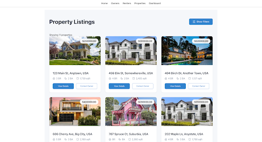

# Property Management Application

## Overview
This Property Management Application is a full-stack web platform designed to help property managers efficiently manage properties, owners, and renters. The application provides an intuitive interface for adding, editing, and deleting property records, as well as filtering listings based on key criteria such as price and number of bedrooms.
<div align="center">
  
  
  
</div>


## Features
- **Property Management:** Add, edit, and delete property listings.
- **Owner & Renter Management:** Store and manage property owners and renters.
- **Filtering & Search:** Find properties based on price, bedrooms, and bathrooms.
- **Interactive Dashboard:** View and manage properties, owners, and renters from a centralized interface.
- **Secure API:** RESTful API built with Express.js for seamless data retrieval and management.
- **Database Management:** PostgreSQL database set up from scratch with efficient schema design.

## Tech Stack
- **Frontend:** React.js (UI development, state management)
- **Backend:** Node.js, Express.js (API development)
- **Database:** PostgreSQL (data storage and management)
- **Hosting/Deployment:** Local environment setup with potential for cloud deployment

## Installation

### Prerequisites
Make sure you have the following installed:
- **Node.js** (v16+ recommended)
- **PostgreSQL** (v14+ recommended)
- **Git**

### Setup Instructions

1. **Clone the Repository**
   ```sh
   git clone https://github.com/git1-shivansh/412.git
   cd 412
   ```

2. **Database Setup**
   - Install PostgreSQL and create a new database:
     ```sh
     createdb property_management
     ```
   - Load the provided dump file:
     ```sh
     psql property_management < property_management_dump.sql
     ```
   - Verify the database:
     ```sh
     psql property_management -U [your_username]
     ```

3. **Backend Setup**
   - Navigate to the backend folder:
     ```sh
     cd backend
     ```
   - Install dependencies:
     ```sh
     npm install
     ```
   - Configure the database connection by updating `db.js` with your PostgreSQL credentials.
   - Start the backend server:
     ```sh
     npm start
     ```

4. **Frontend Setup**
   - Navigate to the frontend folder:
     ```sh
     cd ../frontend
     ```
   - Install dependencies:
     ```sh
     npm install
     ```
   - Start the frontend server:
     ```sh
     npm start
     ```
   - The application should now be running at `http://localhost:3000`

## Usage
- **Navigate to the dashboard** to view property listings.
- **Use the search filters** to refine property searches.
- **Add, update, or delete properties** via the property management interface.
- **Manage owners and renters** by updating their details.


## Contributors
- **Shivansh Shrivastava**
- **Jonathan Tang**
- **Pradyumn Varma**
- **Joseph Martinez**

## Contact
For questions or contributions, feel free to reach out or open an issue on GitHub!
